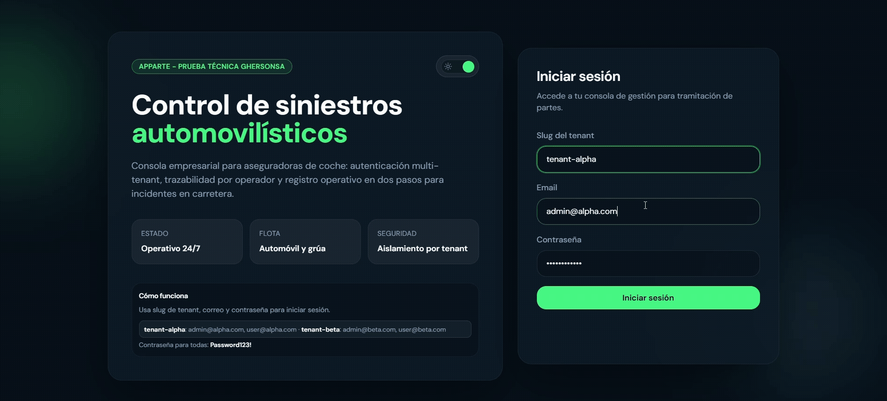
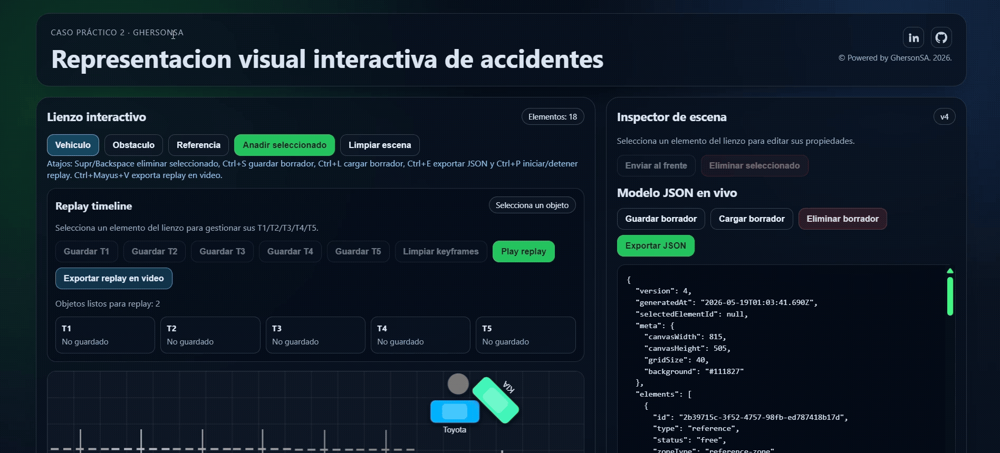

# Apparte Test Técnico

Repositorio de la prueba técnica fullstack. La solución está organizada por casos para que la revisión sea rápida y trazable.

## Vista rápida (demos)

### Caso 1 - Multi-tenant



### Caso 2 - Editor visual Konva



## Estructura

- `caso-1-multitenant/`
  - `backend/`: Node.js + Express + Prisma + PostgreSQL
  - `frontend/`: React + Vite + TailwindCSS
- `caso-2-konva/`
  - `frontend`: React + Konva (representacion visual interactiva)
- `docker-compose.yml`: orquestación local de base de datos, backend y frontend

## Documentación por caso

- Caso 1: `caso-1-multitenant/README.md`
- Caso 2: `caso-2-konva/README.md`

## Arranque local (en 1 minuto)

1. Iniciar Docker Desktop.
2. Desde la raíz del repositorio ejecutar:

```bash
docker compose up --build -d
```

3. En primer arranque (o tras reiniciar volumen), aplicar migraciones y seed:

```bash
docker compose exec backend npm run db:deploy
docker compose exec backend npm run db:seed
```

4. Abrir:

- Frontend: `http://localhost:5173`
- API health: `http://localhost:3001/api/health`

## Credenciales de prueba

- `tenantSlug`: `tenant-alpha`
- `email`: `admin@alpha.com`
- `password`: el valor de `SEED_DEFAULT_PASSWORD` en `.env`

## Parar servicios

```bash
docker compose down
```

## Información adicional

**MÉTRICAS DE INGENIERÍA Y BUENAS PRÁCTICAS**

- Tiempo total de desarrollo e investigación: ~9 horas de ejecución limpia.
- Flujo de control de versiones: implementación rigurosa de Git Flow mediante ramas de características independientes.
- Estándar de mensajes de commit: uso estricto de Conventional Commits (`feat(db):`, `chore(repo):`, `docs(case1):`, etc.).
- Decisiones de colores y componentes basadas en psicología visual del usuario para priorizar claridad y foco.
- Estrategia de validación técnica: build/lint/test ejecutados tras cambios relevantes para minimizar regresiones.
- Arquitectura orientada a mantenibilidad: separación por casos, módulos y responsabilidades por capa.
- Seguridad en profundidad (caso 1): autenticación JWT, autorización por roles y aislamiento multi-tenant reforzado en aplicación + base de datos.
- Trazabilidad documental: README principal + README por caso con objetivos, evidencias y demos visuales.


