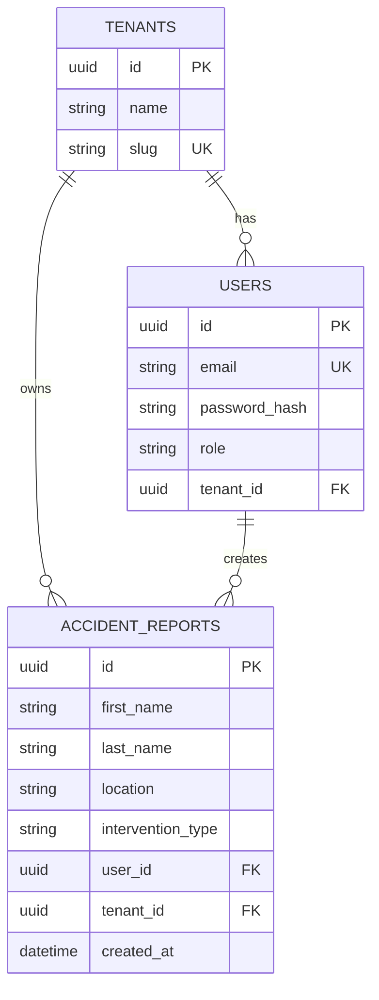
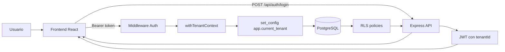
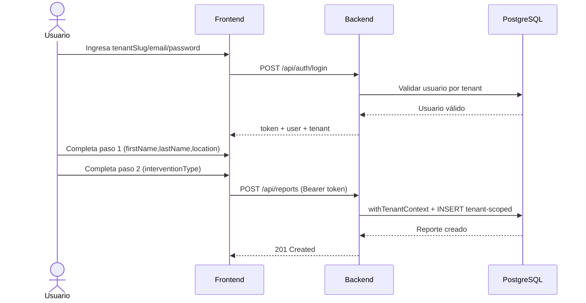

# Caso 1 - Aplicación web multi-tenant con formulario en dos pasos

Este caso implementa una solución fullstack sencilla, con foco en dos puntos clave:


1. Aislamiento multi-tenant real (no solo por convención en código).
2. Flujo de formulario en dos pasos, persistido vía API REST.

## Stack técnico

- Frontend: React + Vite + TailwindCSS
- Backend: Node.js + Express + TypeScript
- Base de datos: PostgreSQL
- ORM: Prisma
- Autenticación: JWT (Bearer token)
- Validación: Zod

## Alcance implementado

- Login y sesión de usuario
- Autorización básica por rol (`USER`, `ADMIN`)
- Soporte multi-tenant con aislamiento de datos
- Formulario en dos pasos:
  - Paso 1: `firstName`, `lastName`, `location`
  - Paso 2: `interventionType`
- Persistencia en PostgreSQL asociando cada registro a `user` y `tenant`

## Estructura del caso

```text
caso-1-multitenant/
├─ backend/
│  ├─ prisma/
│  ├─ src/
│  │  ├─ config/
│  │  ├─ middlewares/
│  │  ├─ modules/
│  │  │  ├─ auth/
│  │  │  └─ reports/
│  │  └─ shared/
│  └─ Dockerfile
└─ frontend/
   ├─ src/
   │  ├─ api/
   │  ├─ components/
   │  ├─ context/
   │  ├─ hooks/
   │  ├─ pages/
   │  └─ types/
   └─ Dockerfile
```

## Ejecución local

Desde la raíz del repositorio:

1. Levantar servicios:

```bash
docker compose up --build -d
```

2. Aplicar migraciones y seed de prueba:

```bash
docker compose exec backend npm run db:deploy
docker compose exec backend npm run db:seed
```

3. Acceder a la aplicación:

- Frontend: `http://localhost:5173`
- Backend: `http://localhost:3001`
- Health: `GET /api/health`

4. Parar servicios:

```bash
docker compose down
```

## Variables de entorno

Archivo `.env` en raíz (ver `.env.example`):

- `POSTGRES_DB`
- `POSTGRES_USER`
- `POSTGRES_PASSWORD`
- `POSTGRES_PORT` (host por defecto `5433`)
- `JWT_SECRET`
- `JWT_EXPIRES_IN`
- `PASSWORD_SALT_ROUNDS`
- `SEED_DEFAULT_PASSWORD`

Referencia backend:

- `caso-1-multitenant/backend/.env.example`

## Modelo de datos

### Tablas

- `tenants`
  - `id` (PK)
  - `name`
  - `slug` (único)

- `users`
  - `id` (PK)
  - `email`
  - `password_hash`
  - `role` (`USER` o `ADMIN`)
  - `tenant_id` (FK -> `tenants.id`)

- `accident_reports`
  - `id` (PK)
  - `first_name`
  - `last_name`
  - `location`
  - `intervention_type`
  - `user_id` (FK -> `users.id`)
  - `tenant_id` (FK -> `tenants.id`)

### Relaciones

- Un tenant tiene muchos usuarios.
- Un tenant tiene muchos reportes.
- Un usuario puede crear muchos reportes.

## Endpoints implementados

### Autenticación

- `POST /api/auth/login`
  - body: `{ tenantSlug, email, password }`
  - response: `{ token, tenant, user }`

- `GET /api/auth/me`
  - headers: `Authorization: Bearer <token>`
  - response: `{ user }`

- `POST /api/auth/register`
  - headers: `Authorization: Bearer <token>`
  - rol requerido: `ADMIN`
  - body: `{ email, password, role? }`

### Reportes (formulario)

Todos requieren:

- `Authorization: Bearer <token>`

Endpoints:

- `POST /api/reports`
  - body: `{ firstName, lastName, location, interventionType }`

- `GET /api/reports`
  - listado tenant-scoped

- `GET /api/reports/:id`
  - detalle tenant-scoped

- `GET /api/reports/stats`
  - total y agregados por tipo de intervención

- `DELETE /api/reports/:id`
  - permitido para propietario o admin

## Cómo se garantiza el aislamiento multi-tenant

El aislamiento está implementado en dos capas, de forma intencionadamente redundante:

1. Capa aplicación
- El JWT incluye `tenantId`.
- Cada operación de datos tenant-scoped se ejecuta dentro de `withTenantContext(...)`.
- Dentro de esa transacción se fija `app.current_tenant` con:
  - `set_config('app.current_tenant', <tenantId>, true)`

2. Capa base de datos
- RLS habilitado y forzado en `users` y `accident_reports`.
- Políticas RLS que solo permiten filas donde:
  - `tenant_id = current_setting('app.current_tenant', true)`

Resultado: aunque una consulta se escriba sin filtro explícito por tenant, PostgreSQL sigue aplicando el aislamiento.

## Datos de prueba

El seed crea dos tenants y usuarios para cada tenant.

Login de referencia:

- `tenantSlug`: `tenant-alpha`
- `email`: `admin@alpha.com`
- `password`: valor de `SEED_DEFAULT_PASSWORD`

## Credenciales demo (acceso rápido)

Para revisar el caso en minutos, usa estas credenciales de referencia del seed:

- `tenantSlug`: `tenant-alpha`
- `email`: `admin@alpha.com`
- `password`: valor definido en `SEED_DEFAULT_PASSWORD`

## Diagrama ER (Mermaid)



## Arquitectura de petición (Mermaid)



## Flujo E2E: login + formulario en 2 pasos



## Seguridad aplicada (checklist)

- [x] JWT Bearer para autenticación
- [x] Validación de payload con Zod
- [x] Autorización por rol (`USER`, `ADMIN`)
- [x] Aislamiento tenant-scoped en capa aplicación
- [x] Aislamiento tenant-scoped en capa BD con RLS
- [x] Eliminación de reportes restringida (owner o admin)

## Ejemplos API (cURL)

1. Login

```bash
curl -X POST http://localhost:3001/api/auth/login \
  -H "Content-Type: application/json" \
  -d '{
    "tenantSlug":"tenant-alpha",
    "email":"admin@alpha.com",
    "password":"<SEED_DEFAULT_PASSWORD>"
  }'
```

2. Crear reporte

```bash
curl -X POST http://localhost:3001/api/reports \
  -H "Authorization: Bearer <TOKEN>" \
  -H "Content-Type: application/json" \
  -d '{
    "firstName":"Ana",
    "lastName":"Pérez",
    "location":"Madrid",
    "interventionType":"RESCATE"
  }'
```

3. Obtener estadísticas

```bash
curl -X GET http://localhost:3001/api/reports/stats \
  -H "Authorization: Bearer <TOKEN>"
```

## Matriz de cumplimiento (enunciado + evidencia + PLUS)

| Objetivo | Evidencia implementada | PLUS |
|---|---|---|
| Aislamiento multi-tenant real | `withTenantContext(...)` + `set_config(...)` + RLS en `users` y `accident_reports` | Doble capa de aislamiento (aplicación + BD) para defensa en profundidad |
| Formulario en 2 pasos | Paso 1 (`firstName`, `lastName`, `location`) + Paso 2 (`interventionType`) | Persistencia vía API y trazabilidad por `user_id` + `tenant_id` |
| API REST funcional | Endpoints de auth + CRUD/reportes + stats | Endpoint de estadísticas para valor analítico adicional |
| Seguridad base | JWT + roles (`USER`, `ADMIN`) + validación de payload | Reglas de borrado por ownership o rol admin |

## Checklist de validación para evaluación

- [ ] La app levanta con `docker compose up --build -d`
- [ ] Seed ejecutado sin errores (`db:seed`)
- [ ] Login válido en tenant correcto
- [ ] Login rechazado en tenant incorrecto
- [ ] Usuario de tenant A no ve datos de tenant B
- [ ] Flujo 2 pasos guarda reporte correctamente
- [ ] Endpoint de stats responde datos consistentes
- [ ] Política de borrado cumple owner/admin

## Troubleshooting

1. Error de conexión a PostgreSQL
- Verifica que el puerto publicado no esté ocupado (`POSTGRES_PORT`, por defecto `5433`).

2. `JWT invalid` o `Unauthorized`
- Repite login y confirma que el header sea `Authorization: Bearer <token>`.

3. Error en migraciones o tablas faltantes
- Ejecuta de nuevo:
  - `docker compose exec backend npm run db:deploy`
  - `docker compose exec backend npm run db:seed`

4. Frontend no conecta con backend
- Comprueba URLs y puertos: frontend `5173`, backend `3001`.

5. No aparece data de demo
- Confirma que `SEED_DEFAULT_PASSWORD` esté definido antes de correr `db:seed`.

## Limitaciones actuales y próximos pasos

Limitaciones actuales:

- No hay refresh token ni rotación de sesión.
- No hay auditoría detallada por evento de seguridad.
- No hay suite e2e automatizada para todo el flujo.

Próximos pasos recomendados:

1. Añadir refresh token con revocación.
2. Incorporar tests e2e (Playwright/Cypress) para escenarios multi-tenant.
3. Agregar auditoría de acciones sensibles (login, create, delete).
4. Incluir rate limiting y hardening adicional de cabeceras.

